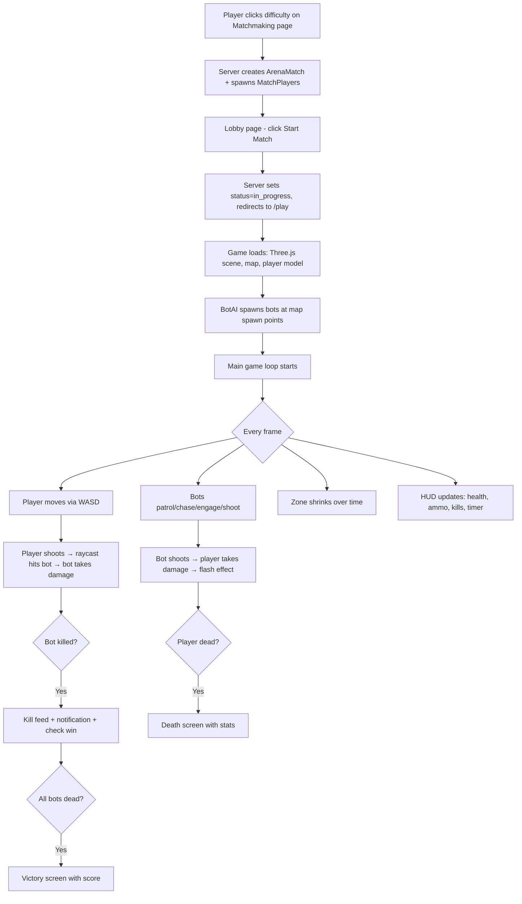

# Nova Arcade — Survival Arena Match Fixes

## Problem Summary
Bots were not loading or functioning in the game because the bot AI relied entirely on a **server-side game loop** (`ProcessGameTick` → `GameLoopService` → `BotService`) that requires a queue worker to be running. Without an active queue worker, bots would spawn with initial positions in the database but **never move, shoot, or pose any threat** — making the match non-functional.

## Root Causes Identified

| Issue | Impact |
|-------|--------|
| `BotAI.js` was a passive syncer only — no local simulation | Bots appeared but stood frozen |
| Server-side `ProcessGameTick` job requires `php artisan queue:work` | Without it, bots have zero AI |
| `main-city.js` relied on server `/state` API for all bot positions | Bots invisible if API fails |
| API routes used `auth:sanctum` but game page uses session auth | API calls could silently fail |
| `check.game.session` middleware returned JSON on a web route | Could block page loading |
| No client-side combat system | Player couldn't kill bots locally |
| No damage-from-bots system | Bots posed no threat to player |

## Changes Made

### 1. Complete `BotAI.js` Rewrite → [BotAI.js](file:///d:/New%20folder/nova-arcade/public/games/survival-arena-3d/js/services/BotAI.js)
- **Full client-side bot AI** with patrol → chase → engage state machine
- Bots move, strafe, maintain ideal distance from player
- Bots shoot at player with difficulty-scaled accuracy & damage
- Difficulty profiles: easy (slow, inaccurate), medium (balanced), hard (aggressive, precise)
- Local bot spawning when server provides no bots
- Ray-based hitbox detection for player bullets hitting bots
- Death animation trigger and kill tracking
- Muzzle flash and audio for bot shooting

### 2. Complete `main-city.js` Rewrite → [main-city.js](file:///d:/New%20folder/nova-arcade/public/games/survival-arena-3d/js/main-city.js)
- **Client-side health/shield/ammo system** — no longer depends on server state
- **Local combat**: player shoots → raycast against bot hitboxes → damage/kill
- **Bot-to-player combat**: bots shoot → damage player → health deduction → death screen
- **Zone system**: 4 phases of shrinking safe zone with increasing damage
- **Kill feed**: local kill tracking with animated entries
- **Hit markers**: crosshair changes color on hit (orange) and headshot (gold)
- **Damage flash**: red vignette overlay when player takes damage
- **Auto-reload**: when ammo depletes, auto-trigger 1.8s reload
- **Match lifecycle**: victory when all bots eliminated, death when health reaches 0
- **Score calculation**: kills × 10 + headshots × 20 + survival bonus + victory bonus
- Server API calls are now **fire-and-forget** (game works without backend)

### 3. CSS Overhaul → [game.css](file:///d:/New%20folder/nova-arcade/public/games/survival-arena-3d/css/game.css)
- Orbitron font for tactical displays
- Gradient health/shield bars with glow effects
- Animated kill feed entries (slide in)
- Hit marker CSS for crosshair feedback
- Damage flash overlay animation
- Polished loading/death/victory screens with glassmorphism
- Responsive layout for mobile

### 4. Backend Fixes
- [game.blade.php](file:///d:/New%20folder/nova-arcade/resources/views/survival-arena/game.blade.php): Added `difficulty`, `botCount` to JS gameData
- [web.php](file:///d:/New%20folder/nova-arcade/routes/web.php): Removed `check.game.session` middleware from play route  
- [api.php](file:///d:/New%20folder/nova-arcade/routes/api.php): Added `web` guard alongside `sanctum` for session auth support

## Match Flow (How It Works Now)

## How To Run

1. Start PHP server: `php artisan serve`
2. Start Vite dev server: `npm run dev`  
3. Login → Navigate to `/survival-arena`
4. Choose difficulty → Click Start Match → Play!

> [!TIP]
> The game now works fully client-side for bot AI. Even if the queue worker isn't running, bots will move, shoot, and be killable. The server is only needed for match creation/auth.
